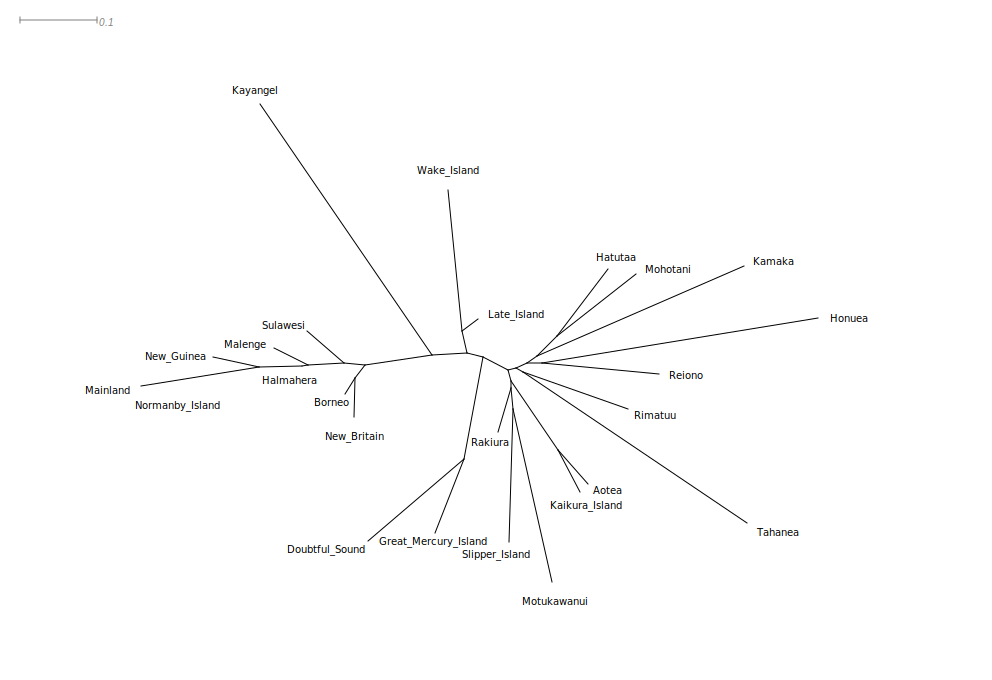
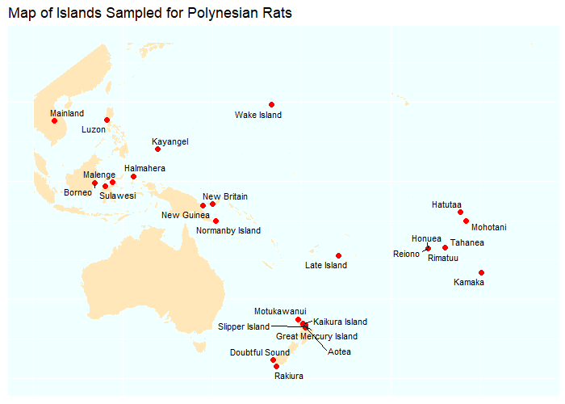
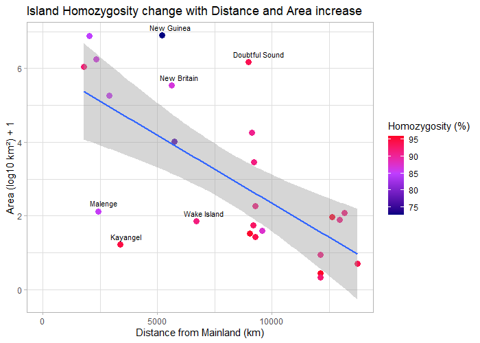
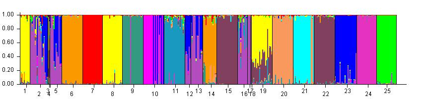

```{r setup, include=FALSE}
library(readr)
library(phangorn)
```

# Introduction

This workflow summarizes the findings of the F~st~ calculations, the structure 
analysis, and the homozygosity estimates in a single synthesis. Pairwise (i.e. 
island-to-island) F~st~ has already been calculated (in Arlequin) and we had a 
[lower triangle matrix](../results/Arlequin_FST/fst_pairwisedistances_only.csv). 
Using the [list of populations](../results/STRUCTURE_Fst/populations.txt) we can 
hand edit the CSV matrix into a 
[NEXUS distance matrix](../data/STRUCTURE_Fst/distmat.nex). In SplitsTree4 we 
can then use this to create, for example, a NJ tree (default settings) of the 
localities:

 

The overall pattern comports largely with the geography:

 

The pattern is one where there is a 'clade' that spans the entirety of 
Indonesia, the SE Asian mainland, as well as islands around New Guinea. Linkage 
disequilibrium between all of these is low compared to within and among the 
other clades, which are more distal from each other and (mostly) on smaller 
islands.

Inbreeding is also lower in the left-hand clade. Note, especially, that New 
Guinea also has low homozygosity:



This calls into question the original narrative of an expansion that is purely 
mediated by hitchhiking with humans out of a continental SE Asian Urheimat (or 
Taiwan). Rather, the native distribution includes Indonesia and New Guinea. This 
matches also what is (sort of) visible in the STRUCTURE plot:



1.  Aotea
2.  Borneo
3.  Doubtful_Sound
4.  Great_Mercury_Island
5.  Halmahera
6.  Hatutaa
7.  Honuea
8.  Kaikura_Island
9.  Kamaka
10. Kayangel
11. Late_Island
12. Mainland
13. Malenge
14. Mohotani
15. Motukawanui
16. New_Britain
17. New_Guinea
18. Normanby_Island
19. Rakiura
20. Reiono
21. Rimatuu
22. Slipper_Island
23. Sulawesi
24. Tahanea
25. Wake_Island

16, 17, 18 show a structure that resembles 12 (mainland!), 13, 2 and 5. As well,
they show greater ancient diversity - in the sense of being shaped by multiple
ancestral populations. That is not something you would expect had they gone
through (successive) founder events. In fact, it seems to fit better with a 
pattern that is a mix of natural distribution throughout island SE Asia. One 
2014 [study](https://doi.org/10.1371%2Fjournal.pone.0091356) actually places the 
center of origin on Flores. I think that should be the story.